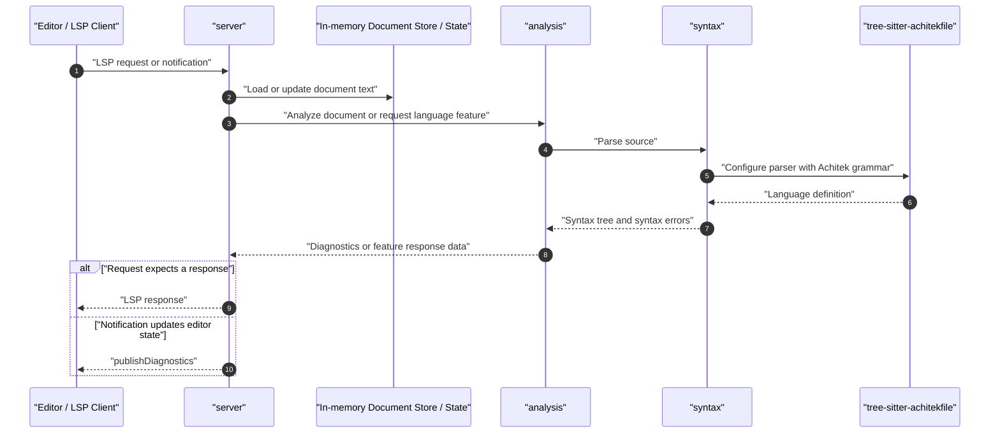

# Architecture

This document describes the current crate layout, module responsibilities, and
request flow for the Achitekfile language server.

## Crate Structure

The current package exposes one library crate and one binary:

- `src/main.rs`
  Parses command-line arguments, initializes logging, constructs the server, and
  runs it.
- `src/server`
  Owns LSP protocol handling, editor communication, document lifecycle, and
  in-memory server state. Request and notification handling is split into
  focused modules under `src/server/handlers`.
- `src/analysis.rs`
  Owns editor-facing language analysis. It consumes parsed syntax trees and
  produces diagnostics, symbols, hover text, completions, definitions,
  references, and rename information.
- `src/syntax.rs`
  Owns parsing Achitek source with Tree-sitter, source ranges, syntax-tree
  wrappers, and syntax-level errors.
- `src/capabilities.rs`
  Defines the LSP capabilities advertised during initialization.
- `src/arguments.rs`
  Parses command-line options, including the communication channel.

The old `server`, `analysis`, and `syntax` workspace directories remain as
legacy reference material during the refactor. The active implementation lives
under `src`.

The Achitek Tree-sitter grammar itself lives outside this repository and is used
through the `tree-sitter-achitekfile` dependency.

## Dependency Direction

The intended dependency layering is:

`server -> analysis -> syntax -> tree-sitter-achitekfile`

This direction matters:

- `server` should know about LSP, but not Tree-sitter details
- `analysis` should know about language meaning, but not transport concerns
- `syntax` should know about parsing, but not semantic meaning or LSP types

Keeping these boundaries sharp makes the code easier to test and easier to
change as the server grows.

## Current State

Today, the active crate has the following implemented pieces:

- `syntax`
  Parses Achitek source into a `SyntaxTree` and collects recoverable syntax
  issues from Tree-sitter error and missing nodes.
- `analysis`
  Calls into `syntax`, translates syntax issues into analysis diagnostics, and
  provides semantic diagnostics and editor feature data.
- `server`
  Maintains open documents, publishes diagnostics, handles supported LSP
  requests, and scans nearby `.tera` templates for prompt references.
- `main`
  Initializes stderr logging with `ACHITEK_LOG` and starts the selected
  communication channel.

## Request Flow

## Document Store

The server maintains an in-memory view of open documents so analysis runs
against the latest editor contents rather than only what is on disk.

This state includes:

- document URI
- document version
- current text

Analysis is currently recomputed per request. Cached syntax or analysis results
can be added later if profiling shows it is necessary.

## Template Awareness

Achitekfiles can be paired with `.tera` templates that reference prompt names.
The server scans nearby templates to support:

- diagnostics for unknown template prompt references
- go-to-definition from template references back to Achitekfile prompt
  declarations
- find-references results that include template usages
- rename edits that update template usages

Template scanning lives in `src/server/utils.rs` because it supports multiple
handlers rather than handling a single LSP method directly.

## Logging

Logs are emitted with `tracing` and written to stderr. Stdout is reserved for
LSP transport data.

`ACHITEK_LOG` controls filtering:

- unset or `info`
  Lifecycle events such as startup, initialization, channel selection, shutdown,
  and IO-thread joining.
- `debug`
  Request and notification flow, document lifecycle, diagnostic counts, and
  template scans.
- target filters such as `achitek_ls=debug,lsp_server=warn`
  Fine-grained control using `tracing_subscriber::filter::Targets` syntax.

## Design Principles

- Keep protocol code in `server`
- Keep parsing code in `syntax`
- Keep language meaning in `analysis`
- Prefer crate-local types over leaking Tree-sitter or LSP details across layers
- Grow from document-local features first, then add cross-file semantics

## Near-Term Milestones

1. Add tests around the full server initialize/open/request/shutdown loop
2. Decide whether additional communication channels beyond stdio should be
   implemented
3. Add higher-level code actions after diagnostics stabilize
4. Consider cached analysis if repeated parsing becomes measurable
