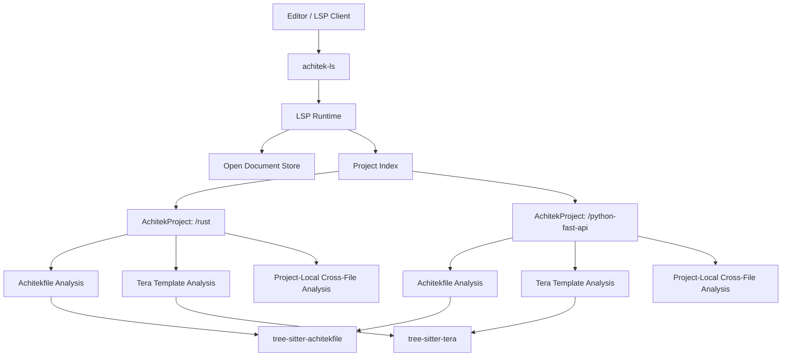
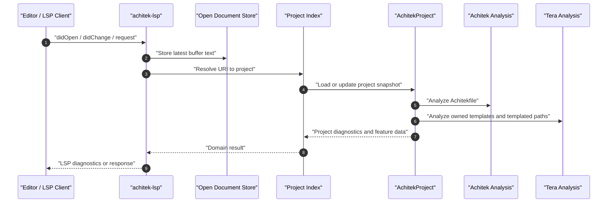

# Architecture Overview

This document describes the intended `achitek-ls` architecture for native Tera
support. It is a northstar for the v0.2.0 refactor: the exact module and crate
names may change, but the ownership boundaries and data flow described here are
the shape the implementation should preserve.

`achitek-ls` is an LSP server for Achitek blueprint authoring. A blueprint is
not only an `achitekfile`; it is an Achitek project made of one root
`achitekfile` plus the Tera templates and templated paths owned by that root.

## Table of Contents

- [1. Architectural Principles](#1-architectural-principles)
- [2. Project Structure](#2-project-structure)
- [3. Achitek Project Model](#3-achitek-project-model)
- [4. High-Level System Diagram](#4-high-level-system-diagram)
- [5. Core Components](#5-core-components)
  - [5.1. Editor Client](#51-editor-client)
  - [5.2. Language Server Binary](#52-language-server-binary)
  - [5.3. LSP Runtime](#53-lsp-runtime)
  - [5.4. Project Index](#54-project-index)
  - [5.5. Achitekfile Syntax and Analysis](#55-achitekfile-syntax-and-analysis)
  - [5.6. Tera Syntax and Analysis](#56-tera-syntax-and-analysis)
  - [5.7. Cross-File Project Analysis](#57-cross-file-project-analysis)
- [6. Request and Diagnostic Flow](#6-request-and-diagnostic-flow)
- [7. Cache Invalidation and File Watching](#7-cache-invalidation-and-file-watching)
- [8. Development and Testing Environment](#8-development-and-testing-environment)
- [9. Future Considerations](#9-future-considerations)

## 1. Architectural Principles

- Project isolation is mandatory. Diagnostics, references, rename edits,
  completions, and navigation must never leak between sibling or nested
  Achitek projects.
- Reusable analysis belongs outside the LSP layer. Syntax and semantic analysis
  should use domain types, not `lsp-types`.
- Tera support is native. Tera parsing should be backed by `tree-sitter-tera`,
  not ad hoc string scanning.
- Tera analysis should be useful without Achitek. A future standalone Tera
  language server should be able to reuse the Tera syntax and analysis layers.
- Achitek-specific behavior belongs in the project layer. The project layer
  decides whether a Tera variable is supplied by an Achitek prompt.
- Open editor buffers take precedence over disk state. The server should
  analyze what the user sees, not only what has been saved.

## 2. Project Structure

The target shape is a Rust workspace with reusable crates for language syntax,
language analysis, project indexing, and LSP protocol handling.

```text
achitek-ls/
├── crates/
│   ├── achitek-syntax/        # tree-sitter-achitekfile wrapper and ranges
│   ├── achitek-analysis/      # Achitekfile symbols, diagnostics, navigation
│   ├── tera-syntax/           # tree-sitter-tera wrapper and ranges
│   ├── tera-analysis/         # Tera variables, locals, scopes, references
│   ├── achitek-project/       # Project discovery, indexing, cross-file checks
│   └── achitek-lsp/           # LSP runtime, handlers, protocol conversion
├── src/
│   └── main.rs                # Thin binary entry point
├── docs/
│   ├── ARCHITECTURE.md        # This document
│   └── CAPABILITIES.md        # Supported editor capabilities
├── Cargo.toml                 # Workspace metadata
├── flake.nix                  # Reproducible Nix development environment
├── justfile                   # Common development commands
└── lefthook.yml               # Git hook configuration
```

The crate names are not sacred. The dependency direction is.

```text
achitek-lsp
    -> achitek-project
        -> achitek-analysis -> achitek-syntax
        -> tera-analysis    -> tera-syntax
```

The lower layers must not depend on the LSP crate.

## 3. Achitek Project Model

An Achitek project is a directory whose root contains an `achitekfile` or
`Achitekfile`. That root owns all descendant Tera templates and templated paths,
except descendants that belong to a nested Achitek project.

Example workspace:

```text
.
├── blueprints.toml
├── python-fast-api
│   ├── achitekfile
│   ├── README.md.tera
│   └── src
│       └── main.py.tera
└── rust
    ├── achitekfile
    ├── Cargo.toml.tera
    └── src
        └── main.rs.teralib.rs.tera
```

This workspace contains two independent projects:

```text
ProjectId("/python-fast-api")
ProjectId("/rust")
```

The `/rust` project must not see prompts or template references from
`/python-fast-api`, and `/python-fast-api` must not see prompts or template
references from `/rust`.

Project resolution for a file works like this:

1. Start from the file's directory.
2. Walk upward until an `achitekfile` or `Achitekfile` is found.
3. The containing directory is the owning project root.
4. If no Achitekfile is found, the file is outside any Achitek project.

Project indexing works like this:

1. Start at the project root.
2. Include the root Achitekfile.
3. Include descendant `.tera` files.
4. Include descendant file or directory names that contain Tera delimiters.
5. Stop descending when a nested directory contains its own Achitekfile.

## 4. High-Level System Diagram



## 5. Core Components

### 5.1. Editor Client

Name: Editor or LSP client

The user interface that launches `achitek-ls`, sends LSP requests and
notifications, and renders diagnostics, completions, hover text, document
symbols, workspace symbols, navigation, formatting edits, folding ranges,
selection ranges, references, and rename edits.

### 5.2. Language Server Binary

Name: `achitek-ls`

The executable language server. It parses command-line arguments, initializes
logging, selects the communication channel, performs the LSP initialize
handshake, and starts the LSP runtime.

The binary should stay thin. It should not own language analysis or project
indexing behavior.

### 5.3. LSP Runtime

Name: `achitek-lsp`

Owns protocol handling, request dispatch, notification dispatch, diagnostics
publishing, and conversion between domain types and LSP types.

Responsibilities:

- Maintain the open document store.
- Apply full-document or incremental text changes.
- Ask the project index which project owns a URI.
- Convert analysis diagnostics into `textDocument/publishDiagnostics`.
- Convert project navigation results into LSP response types.

The LSP runtime should not parse Tera or Achitekfile source directly.

### 5.4. Project Index

Name: `achitek-project`

Owns workspace roots, Achitek project discovery, project membership, cached
analysis, and cross-file relationships.

Core types:

```text
ProjectId
AchitekProject
ProjectIndex
ProjectDocument
TemplateDocument
TemplatePath
ProjectDiagnostics
```

Responsibilities:

- Resolve a file URI to its nearest owning Achitek project.
- Discover projects under workspace roots.
- Index owned Achitekfiles, Tera templates, and templated paths.
- Keep sibling and nested projects isolated.
- Prefer open buffer text over disk text.
- Provide project-local diagnostics, references, definitions, hovers, and
  rename ranges to the LSP layer.

### 5.5. Achitekfile Syntax and Analysis

Names: `achitek-syntax`, `achitek-analysis`

`achitek-syntax` owns Tree-sitter parsing for Achitekfile source. It wraps
`tree-sitter-achitekfile`, source text, syntax errors, and source ranges.

`achitek-analysis` owns Achitekfile semantics:

- prompt symbols
- dependency-expression references
- syntax and semantic diagnostics
- document symbols
- hover data
- completion data
- definition targets
- reference targets
- rename targets
- formatting, folding, and selection ranges where applicable

This layer should expose reusable domain types. LSP conversion belongs in
`achitek-lsp`.

### 5.6. Tera Syntax and Analysis

Names: `tera-syntax`, `tera-analysis`

`tera-syntax` owns Tree-sitter parsing for Tera source. It wraps
`tree-sitter-tera`, source text, syntax errors, and source ranges.

`tera-analysis` owns Tera semantics independent of Achitek:

- external variable references
- local bindings from `for`, `set`, `set_global`, macros, and imports
- lexical or template scopes where needed
- reference-at-position
- all references for a variable
- ranges suitable for rename and diagnostics
- exclusion of filters, tests, functions, keywords, builtins, and member names

This layer does not decide whether `author` is valid. It only reports that
`author` is an external variable reference at a source range.

Tera analysis must support both template contents and Tera embedded in file or
directory names.

### 5.7. Cross-File Project Analysis

Name: `achitek-project`

Cross-file analysis binds Achitekfile prompt definitions to Tera variable
references in one project.

Project-local diagnostic rules include:

- Unknown template variable: a Tera reference such as `author` exists, but the
  owning project's Achitekfile does not define a prompt named `author`.
- Unused prompt: the owning project's Achitekfile defines a prompt such as
  `author`, but no owned template content or templated path references it.

Both diagnostics are project-scoped. A prompt in `/rust/achitekfile` cannot
satisfy a reference in `/python-fast-api`, and a reference in
`/python-fast-api` cannot make a `/rust` prompt count as used.

## 6. Request and Diagnostic Flow



For a Tera definition request:

1. Resolve the Tera file or templated path to its owning project.
2. Ask `tera-analysis` for the external variable at the cursor.
3. Ask the project symbol table for a matching Achitek prompt.
4. Return the prompt declaration location if found.

For an Achitek prompt references request:

1. Resolve the Achitekfile to its owning project.
2. Find document-local Achitek references.
3. Find project-local Tera references in owned templates and templated paths.
4. Return the combined locations.

For rename:

1. Identify the prompt or Tera variable reference under the cursor.
2. Resolve the owning project.
3. Produce edits for the Achitekfile and owned Tera references only.
4. Do not produce edits for sibling or nested projects.

## 7. Cache Invalidation and File Watching

The project index may cache parsed syntax trees and semantic analysis results.
Invalidation should be conservative and project-scoped.

Events that invalidate project state:

- Opening or changing an Achitekfile invalidates that project's prompt symbols,
  Achitek diagnostics, cross-file diagnostics, and dependent Tera features.
- Opening or changing a Tera template invalidates that template analysis and
  project-level unused-prompt diagnostics.
- Creating or deleting a Tera template invalidates the owning project index.
- Creating or deleting an Achitekfile may change project ownership for
  descendants and should invalidate affected parent and child project records.
- Renaming a file or directory may change templated path analysis and project
  ownership.

When both disk text and open buffer text exist for the same URI, the open
buffer text wins.

## 8. Development and Testing Environment

Local setup instructions: See [Contributing](../CONTRIBUTING.md).

Testing frameworks: Rust unit and integration tests through Cargo. The
preferred project test command is `just test`, which runs `cargo nextest`.

Code quality tools: `rustfmt`, Clippy, `lefthook`, `just`, Nix.

Useful commands:

```sh
nix develop
just test
just clippy
just fmt-check
just pre-commit
```

Important test scenarios:

- One project with one Achitekfile and multiple templates.
- Sibling projects that define and reference different prompts.
- Nested projects where the parent must not index the child.
- Unknown Tera variables.
- Unused Achitek prompts.
- Tera references in file contents.
- Tera references in file and directory names.
- Open-buffer text taking precedence over disk text.
- Rename edits staying within the owning project.

## 9. Future Considerations

- Add code actions for common diagnostics, such as creating a missing prompt or
  removing an unused prompt.
- Add semantic tokens for Achitekfile and Tera template regions.
- Add inlay hints where they clarify expected prompt value shapes.
- Consider exposing `tera-analysis` as a standalone crate for community use.
- Consider whether enough Tera behavior exists to justify a standalone Tera
  language server built on the reusable Tera crates.
- Decide whether communication channels beyond stdio should be implemented.

See [CAPABILITIES.md](CAPABILITIES.md) for the capability matrix and candidate
future editor features.
