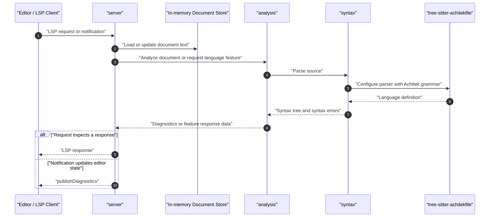

# Architecture Overview

This document is a living overview of the `achitek-ls` codebase. It's meant
for humans and agents who want to understand the project quickly, navigate the source with
confidence, and make changes without losing the architectural thread. Update it
as the codebase evolves.

## Table of Contents

- [1. Project Structure](#1-project-structure)
- [2. High-Level System Diagram](#2-high-level-system-diagram)
- [3. Core Components](#3-core-components)
  - [3.1. Editor Client](#31-editor-client)
  - [3.2. Language Server Binary](#32-language-server-binary)
  - [3.3. Server Runtime](#33-server-runtime)
  - [3.4. Analysis Layer](#34-analysis-layer)
  - [3.5. Syntax Layer](#35-syntax-layer)
- [4. Development & Testing Environment](#4-development--testing-environment)
- [5. Future Considerations / Roadmap](#5-future-considerations--roadmap)

## 1. Project Structure

`achitek-ls` is a Rust language server package with a single binary and
library code. The binary is the user-facing interface; the library target
exists to share implementation code with `src/main.rs`. Most internal modules
are hidden from generated Rust documentation unless they become a deliberate
public API.

```text
achitek-ls/
├── src/
│   ├── main.rs                 # Binary entry point, logging setup, server startup
│   ├── lib.rs                  # Library wiring for the binary and rustdoc visibility
│   ├── arguments.rs            # Command-line argument types and parser
│   ├── capabilities.rs         # LSP capabilities advertised during initialize
│   ├── syntax.rs               # Tree-sitter parsing, source ranges, syntax errors
│   ├── analysis.rs             # DSL diagnostics, symbols, hover, completion, navigation
│   └── server/
│       ├── mod.rs              # LSP lifecycle, document store, dispatch loop
│       ├── utils.rs            # Shared template-aware helpers
│       └── handlers/           # One module per LSP request or notification group
├── docs/
│   ├── ARCHITECTURE.md         # This document
│   └── CAPABILITIES.md         # Supported and planned editor capabilities
├── CONTRIBUTING.md             # Local setup, commands, tests, and contribution notes
├── README.md                   # Project overview, usage, logging, and doc links
├── Cargo.toml                  # Rust package metadata and dependencies
├── flake.nix                   # Reproducible Nix development environment
├── justfile                    # Common development commands
└── lefthook.yml                # Git hook configuration
```

## 2. High-Level System Diagram

At runtime, an editor or LSP client launches `achitek-ls`, usually over stdio.
The server receives LSP messages, keeps an in-memory copy of open documents,
analyzes Achitekfile source, optionally scans nearby `.tera` templates, and
responds with diagnostics or editor feature data.

```text
[Editor / LSP Client]
        |
        | JSON-RPC over stdio
        v
[achitek-ls server]
        |
        +--> [In-memory open documents]
        |
        +--> [analysis] --> [syntax] --> [tree-sitter-achitekfile]
        |
        +--> [nearby .tera template files]
```

The request flow inside the server looks like this:



## 3. Core Components

### 3.1. Editor Client

Name: Editor or LSP client

The user interface that launches `achitek-ls`, sends LSP requests
and notifications, and renders diagnostics, completions, hover text, symbols,
navigation, formatting edits, folding ranges, selection ranges, references, and
rename edits.

> [!Warning]
> At the moment the only client that has been tested is `neovim v0.12.0`.

### 3.2. Language Server Binary

Name: `achitek-ls`

The executable language server. It parses command-line arguments,
initializes stderr logging, selects the communication channel, performs the LSP
initialize handshake, and runs the server loop.

### 3.3. Server Runtime

Name: `src/server`

Owns LSP protocol handling, the open-document store, request and
notification dispatch, diagnostics publishing, and cross-file template support.
Handlers are split by LSP method under `src/server/handlers`.

### 3.4. Analysis Layer

Name: `src/analysis.rs`

Owns editor-facing language meaning. It consumes parsed syntax and
produces semantic diagnostics, document symbols, hover text, completions,
definition targets, references, rename targets, and related ranges.

### 3.5. Syntax Layer

Name: `src/syntax.rs`

Owns parsing and source mapping. It configures Tree-sitter with
the Achitekfile grammar, wraps parsed trees, computes text ranges, extracts
source text, and reports recoverable syntax errors.

## 4. Development & Testing Environment

Local Setup Instructions: See [Contributing](../CONTRIBUTING.md).

Testing Frameworks: Rust unit tests through Cargo. The preferred project test
command is `just test`, which runs `cargo nextest`.

Code Quality Tools: `rustfmt`, Clippy, `lefthook`, `just`, Nix.

Useful commands:

```sh
nix develop
just test
just clippy
just fmt-check
just pre-commit
```

## 5. Future Considerations / Roadmap

- Add tests around the full server initialize/open/request/shutdown loop.
- Decide whether communication channels beyond stdio should be implemented.
- Add code actions for common diagnostic fixes.
- Add semantic tokens if grammar highlighting is not expressive enough.
- Add inlay hints where they clarify expected value shapes.
- Consider cached analysis if repeated parsing becomes measurable.
- Consider broader workspace indexing once document-local features remain
  stable.

See [CAPABILITIES.md](CAPABILITIES.md) for the current capability matrix and
candidate future editor features.
